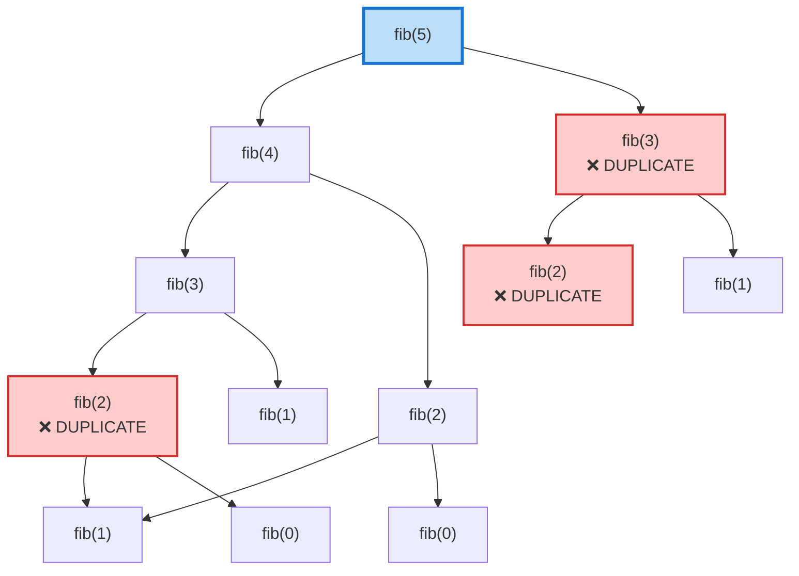

# Fibonacci Number with Memoization

## Problem Description

The Fibonacci sequence is defined as:
- F(0) = 0
- F(1) = 1
- F(n) = F(n-1) + F(n-2) for n > 1

Given an integer `n`, calculate the nth Fibonacci number efficiently using memoization to avoid redundant calculations.

## Examples

### Example 1
```
Input: n = 10
Output: 55
Explanation: The sequence is 0, 1, 1, 2, 3, 5, 8, 13, 21, 34, 55
```

### Example 2
```
Input: n = 0
Output: 0
Explanation: F(0) = 0 by definition
```

### Example 3
```
Input: n = 20
Output: 6765
Explanation: F(20) = 6765
```

## Constraints

- 0 <= n <= 100
- The answer fits in a 64-bit integer

## Hints

<details>
<summary>Hint 1</summary>
The naive recursive solution has exponential time complexity O(2^n) because it recalculates the same values multiple times.
</details>

<details>
<summary>Hint 2</summary>
Use a dictionary/map to store already computed Fibonacci numbers. Before computing F(n), check if it's already in the cache.
</details>

<details>
<summary>Hint 3</summary>
You can also solve this iteratively with O(1) space by only keeping track of the last two numbers.
</details>

## Approach Explanation

### The Problem with Naive Recursion

Without memoization, the recursive call tree looks like this:



Notice how `fib(3)` is calculated twice, `fib(2)` is calculated three times, etc. This leads to O(2^n) time complexity.

### Memoization Solution

With memoization, we store each computed value:

```
Decision Tree with Memoization:

fib(5)
  -> fib(4)
       -> fib(3)
            -> fib(2)
                 -> fib(1) = 1
                 -> fib(0) = 0
                 -> return 1
            -> fib(1) = 1 [cached]
            -> return 2
       -> fib(2) = 1 [cached - no recomputation!]
       -> return 3
  -> fib(3) = 2 [cached - no recomputation!]
  -> return 5
```

### Time and Space Complexity

| Approach | Time | Space |
|----------|------|-------|
| Naive Recursion | O(2^n) | O(n) |
| Memoization | O(n) | O(n) |
| Iterative | O(n) | O(1) |

### Algorithm Steps

1. **Base Cases**: Return 0 for n=0, return 1 for n=1
2. **Check Cache**: If F(n) is already computed, return it
3. **Compute**: Calculate F(n) = F(n-1) + F(n-2)
4. **Store**: Save F(n) in the cache
5. **Return**: Return the computed value
