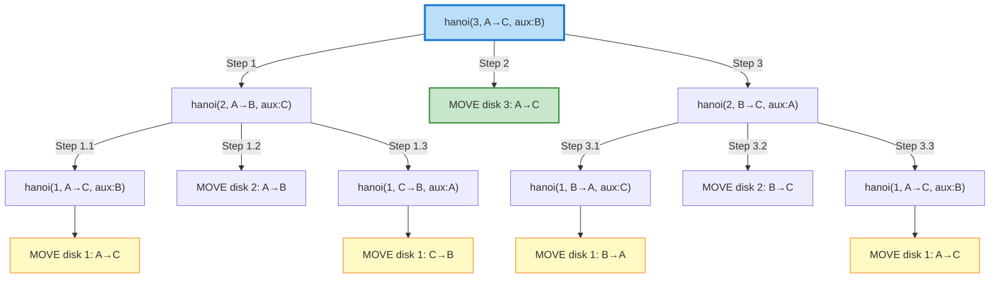

# Tower of Hanoi

## Problem Description

The Tower of Hanoi is a classic mathematical puzzle. You have three rods (pegs) and `n` disks of different sizes which can slide onto any rod. The puzzle starts with all disks stacked on one rod in decreasing order of size (largest at bottom).

The objective is to move the entire stack to another rod, following these rules:
1. Only one disk can be moved at a time
2. Each move consists of taking the top disk from one stack and placing it on top of another stack or an empty rod
3. No larger disk may be placed on top of a smaller disk

Print all the moves required to solve the puzzle.

## Examples

### Example 1
```
Input: n = 2
Output:
Move disk 1 from A to B
Move disk 2 from A to C
Move disk 1 from B to C

Explanation:
Initial:    A: [2,1]  B: []    C: []
After 1:    A: [2]    B: [1]   C: []
After 2:    A: []     B: [1]   C: [2]
After 3:    A: []     B: []    C: [2,1]
```

### Example 2
```
Input: n = 3
Output:
Move disk 1 from A to C
Move disk 2 from A to B
Move disk 1 from C to B
Move disk 3 from A to C
Move disk 1 from B to A
Move disk 2 from B to C
Move disk 1 from A to C

Total moves: 7 (which is 2^3 - 1)
```

## Constraints

- 1 <= n <= 20
- The minimum number of moves required is 2^n - 1

## Hints

<details>
<summary>Hint 1</summary>
Think recursively: To move n disks from A to C, you need to first move n-1 disks somewhere else.
</details>

<details>
<summary>Hint 2</summary>
Break the problem into three steps:
1. Move n-1 disks from source to auxiliary
2. Move the largest disk from source to destination
3. Move n-1 disks from auxiliary to destination
</details>

<details>
<summary>Hint 3</summary>
The base case is when n=1: just move that disk directly from source to destination.
</details>

## Approach Explanation

### The Recursive Insight

To move n disks from rod A to rod C using rod B as auxiliary:

1. **Move top n-1 disks** from A to B (using C as auxiliary)
2. **Move the largest disk** (disk n) from A to C
3. **Move n-1 disks** from B to C (using A as auxiliary)

### Decision Tree Visualization



### Visual State Progression for n=3

```
Step 0 (Initial):
   |         |         |
  [1]        |         |
  [2]        |         |
  [3]        |         |
 -----     -----     -----
   A         B         C

Step 1: Move disk 1 from A to C
   |         |         |
   |         |         |
  [2]        |        [1]
  [3]        |         |
 -----     -----     -----

Step 2: Move disk 2 from A to B
   |         |         |
   |         |         |
   |        [2]       [1]
  [3]        |         |
 -----     -----     -----

Step 3: Move disk 1 from C to B
   |         |         |
   |        [1]        |
   |        [2]        |
  [3]        |         |
 -----     -----     -----

Step 4: Move disk 3 from A to C
   |         |         |
   |        [1]        |
   |        [2]       [3]
   |         |         |
 -----     -----     -----

Step 5: Move disk 1 from B to A
   |         |         |
   |         |         |
  [1]       [2]       [3]
   |         |         |
 -----     -----     -----

Step 6: Move disk 2 from B to C
   |         |         |
   |         |        [2]
  [1]        |        [3]
   |         |         |
 -----     -----     -----

Step 7: Move disk 1 from A to C
   |         |        [1]
   |         |        [2]
   |         |        [3]
   |         |         |
 -----     -----     -----
```

### Time and Space Complexity

| Metric | Value |
|--------|-------|
| Time Complexity | O(2^n) |
| Space Complexity | O(n) - recursion stack |
| Number of Moves | 2^n - 1 |

### Mathematical Proof of Minimum Moves

Let T(n) be the minimum number of moves for n disks:
- T(1) = 1
- T(n) = T(n-1) + 1 + T(n-1) = 2*T(n-1) + 1

Solving this recurrence: T(n) = 2^n - 1
