# Rate Limiter

## Problem Statement

Design a rate limiter that controls the rate of requests a client can make to an API. Support configurable limits like "100 requests per minute per user".

## Requirements

- Limit requests per time window
- Support per-user/per-IP limits
- Return remaining quota
- Handle concurrent requests

---

## Solution Breakdown

### Part 1: Why Do We Need Rate Limiting?

<div style="background: linear-gradient(135deg, #1a1a2e 0%, #16213e 100%); border-radius: 12px; padding: 24px; margin: 20px 0; border-left: 4px solid #e94560;">

**Protection Against:**
- **DoS attacks** - Malicious users flooding your API
- **Misbehaving clients** - Buggy code in infinite loops
- **Resource exhaustion** - Preventing database/server overload
- **Cost control** - Limiting expensive operations

**Business Use Cases:**
- API monetization (free tier: 100 req/day, paid: unlimited)
- Fair usage policies
- Protecting downstream services

</div>

### Part 2: The Core Algorithms Compared

```mermaid
graph TB
    subgraph TB["1️⃣ TOKEN BUCKET"]
        direction TB
        TB1["🪣 Bucket: 4 capacity"]
        TB2["➕ +1 token/sec"]
        TB3["📊 Request uses 1 token"]
        TB1 --> TB2 --> TB3
    end

    subgraph SW["2️⃣ SLIDING WINDOW"]
        direction LR
        SW1["⏱️ 60 sec window"]
        SW2["📍 Window slides →"]
        SW3["📊 Count all requests"]
        SW1 --> SW2 --> SW3
    end

    subgraph FW["3️⃣ FIXED WINDOW"]
        direction LR
        FW1["🪟 Window 1<br/>Requests: 7"]
        FW2["🪟 Window 2<br/>Requests: 3"]
        FW1 -.->|resets| FW2
    end

    subgraph LB["4️⃣ LEAKY BUCKET"]
        direction TB
        LB1["📥 Requests enter"]
        LB2["🪣 Bucket fills"]
        LB3["💧 Process at fixed rate"]
        LB4["❌ Overflow rejected"]
        LB1 --> LB2 --> LB3
        LB2 -.->|exceeds| LB4
    end

    style TB fill:#e3f2fd
    style SW fill:#f3e5f5
    style FW fill:#fff3e0
    style LB fill:#f1f8e9
```

<div style="background: #0d1117; border-radius: 12px; padding: 24px; margin: 20px 0; border: 1px solid #30363d;">



</div>

### Part 3: Token Bucket Deep Dive

<div style="background: linear-gradient(135deg, #1e3a5f 0%, #2d5a7b 100%); border-radius: 12px; padding: 24px; margin: 20px 0; border-left: 4px solid #4ecdc4;">

**Why Token Bucket is Often Preferred:**

1. **Allows Bursts**: If bucket is full (say 20 tokens), user can make 20 requests immediately
2. **Smooth Refill**: Tokens accumulate continuously, not in chunks
3. **Simple State**: Only need `tokens` and `last_update_time`
4. **Memory Efficient**: O(1) per client

**The Math:**
```
current_tokens = min(capacity, old_tokens + (time_elapsed × rate))
```

**Example**: Rate = 10/sec, Capacity = 20
- At t=0: 20 tokens (full)
- User makes 15 requests: 5 tokens left
- After 1 second: 5 + 10 = 15 tokens
- After 0.5 seconds: 5 + 5 = 10 tokens

</div>

### Part 4: Why NOT Fixed Window?

<div style="background: linear-gradient(135deg, #4a1a1a 0%, #6b2d2d 100%); border-radius: 12px; padding: 20px; margin: 16px 0; border-left: 4px solid #ff6b6b;">

**The Boundary Problem:**

```
Limit: 100 requests per minute

Window 1 (00:00 - 01:00)     Window 2 (01:00 - 02:00)
        ↓                            ↓
[.....▪▪▪▪▪▪▪▪▪▪] 100 req   [▪▪▪▪▪▪▪▪▪▪.....] 100 req
       ↑                     ↑
    At 00:59               At 01:00

Result: 200 requests in 2 seconds! (00:59 to 01:01)
```

**Solution**: Sliding window uses weighted average of current + previous window

</div>

### Part 5: Sliding Window Counter Explained

<div style="background: linear-gradient(135deg, #0f0f23 0%, #1a1a3e 100%); border-radius: 12px; padding: 24px; margin: 20px 0;">

**The Weighted Average Trick:**

```
Window size: 60 seconds
Limit: 100 requests

Previous window (00:00-01:00): 84 requests
Current window (01:00-02:00): 36 requests so far
Current time: 01:15 (25% into current window)

Weighted count = 84 × (1 - 0.25) + 36 × 1.0
               = 84 × 0.75 + 36
               = 63 + 36
               = 99

→ Still under 100, request allowed!
```

**Why this works**: Approximates how many requests happened in last 60 seconds without storing each timestamp

</div>

---

## Algorithm Comparison

<div style="background: #0d1117; border-radius: 12px; padding: 24px; margin: 20px 0; border: 1px solid #30363d;">

| Algorithm | Pros | Cons | Best For |
|-----------|------|------|----------|
| **Token Bucket** | Allows bursts, simple | Memory per client | API rate limiting |
| **Leaky Bucket** | Smooth output rate | No burst handling | Network traffic shaping |
| **Fixed Window** | Very simple | Boundary spike problem | Rough estimates |
| **Sliding Window** | Accurate, no boundary issues | More computation | Strict rate limiting |
| **Sliding Log** | Most accurate | O(n) memory per client | When accuracy critical |

</div>

---

## Alternative Approaches

### Alternative 1: Redis-based (Distributed)

<div style="background: linear-gradient(135deg, #1a472a 0%, #2d5a3d 100%); border-radius: 12px; padding: 20px; margin: 16px 0;">

```lua
-- Redis Lua script for atomic token bucket
local key = KEYS[1]
local rate = tonumber(ARGV[1])
local capacity = tonumber(ARGV[2])
local now = tonumber(ARGV[3])
local requested = tonumber(ARGV[4])

local data = redis.call('HMGET', key, 'tokens', 'last_update')
local tokens = tonumber(data[1]) or capacity
local last_update = tonumber(data[2]) or now

-- Refill tokens
local elapsed = now - last_update
tokens = math.min(capacity, tokens + elapsed * rate)

-- Check and consume
if tokens >= requested then
    tokens = tokens - requested
    redis.call('HMSET', key, 'tokens', tokens, 'last_update', now)
    redis.call('EXPIRE', key, 3600)
    return {1, tokens}  -- allowed, remaining
else
    return {0, tokens}  -- denied, remaining
end
```

**Why Lua script?** Atomic execution - no race conditions between read and write

</div>

### Alternative 2: Leaky Bucket (for Traffic Shaping)

```python
class LeakyBucket:
    """Process requests at constant rate - no bursts"""
    def __init__(self, rate: float, capacity: int):
        self.rate = rate  # requests per second
        self.capacity = capacity
        self.water = 0  # current queue size
        self.last_leak = time.time()

    def allow(self) -> bool:
        self._leak()
        if self.water < self.capacity:
            self.water += 1
            return True
        return False

    def _leak(self):
        now = time.time()
        leaked = (now - self.last_leak) * self.rate
        self.water = max(0, self.water - leaked)
        self.last_leak = now
```

### Alternative 3: Sliding Window Log (Most Accurate)

```python
class SlidingWindowLog:
    """Store each request timestamp - most accurate but O(n) space"""
    def __init__(self, limit: int, window_seconds: int):
        self.limit = limit
        self.window = window_seconds
        self.logs = {}  # key -> list of timestamps

    def allow(self, key: str) -> bool:
        now = time.time()
        cutoff = now - self.window

        # Clean old entries
        if key in self.logs:
            self.logs[key] = [t for t in self.logs[key] if t > cutoff]
        else:
            self.logs[key] = []

        if len(self.logs[key]) < self.limit:
            self.logs[key].append(now)
            return True
        return False
```

<div style="background: linear-gradient(135deg, #4a1a1a 0%, #6b2d2d 100%); border-radius: 12px; padding: 20px; margin: 16px 0; border-left: 4px solid #ff6b6b;">

**When to use Sliding Log:**
- When you need exact counts (compliance requirements)
- Low request volume
- When memory isn't a concern

**Avoid when:**
- High traffic (storing millions of timestamps)
- Need sub-millisecond performance

</div>

---

## Pros and Cons Analysis

<div style="display: grid; grid-template-columns: 1fr 1fr; gap: 20px; margin: 20px 0;">

<div style="background: linear-gradient(135deg, #1a472a 0%, #2d5a3d 100%); border-radius: 12px; padding: 20px;">

### Token Bucket Pros

- **O(1) time and space** per operation
- **Allows bursts** - good UX for legitimate users
- **Simple to implement** - just two variables
- **Memory efficient** - constant per client
- **Easy to distribute** - works well with Redis

</div>

<div style="background: linear-gradient(135deg, #4a1a1a 0%, #6b2d2d 100%); border-radius: 12px; padding: 20px;">

### Token Bucket Cons

- **Burst can overwhelm** - if all clients burst simultaneously
- **Memory per client** - need to track each key
- **Clock sync issues** - in distributed systems
- **No request queuing** - just accept/reject
- **Cleanup needed** - stale buckets waste memory

</div>

</div>

---

## Complexity Analysis

| Operation | Time | Space |
|-----------|------|-------|
| `allow(key)` | O(1) | O(1) |
| **Total Space** | - | O(n) where n = unique clients |

**Memory per client:**
- Token Bucket: ~24 bytes (tokens + timestamp + lock)
- Sliding Window: ~48 bytes (two counters + timestamps)
- Sliding Log: O(k) where k = requests in window

---

## Common Extensions

1. **Multi-tier limits**: "100/min AND 1000/hour" - chain multiple limiters
2. **Burst credits**: Allow occasional bursts above limit
3. **Priority queues**: VIP users get higher limits
4. **Rate limit headers**: Return `X-RateLimit-Remaining`, `X-RateLimit-Reset`
5. **Graceful degradation**: Return cached response instead of 429

---

## Interview Tips

<div style="background: linear-gradient(135deg, #2d1f3d 0%, #4a3a5d 100%); border-radius: 12px; padding: 24px; margin: 20px 0;">

1. **Start with requirements** - Per-user? Per-IP? Global?
2. **Explain trade-offs** - Why token bucket over sliding window?
3. **Discuss distributed case** - How to share state across servers?
4. **Mention race conditions** - Why Redis Lua scripts?
5. **HTTP headers** - `X-RateLimit-Limit`, `X-RateLimit-Remaining`, `X-RateLimit-Reset`
6. **Status code** - 429 Too Many Requests

**Common Follow-ups:**
- How to handle clock skew?
- How to rate limit by API key + IP combined?
- How to implement tiered rate limits (free vs paid)?

</div>

---

## Implementation

### Python - Token Bucket

```python
import time
import threading
from dataclasses import dataclass

@dataclass
class RateLimitResult:
    allowed: bool
    remaining: int
    reset_at: float


class TokenBucket:
    def __init__(self, rate: float, capacity: int):
        self.rate = rate  # tokens per second
        self.capacity = capacity
        self.tokens = capacity
        self.last_update = time.time()
        self.lock = threading.Lock()

    def allow(self, tokens: int = 1) -> RateLimitResult:
        with self.lock:
            now = time.time()

            # Refill tokens
            elapsed = now - self.last_update
            self.tokens = min(self.capacity, self.tokens + elapsed * self.rate)
            self.last_update = now

            if self.tokens >= tokens:
                self.tokens -= tokens
                return RateLimitResult(
                    allowed=True,
                    remaining=int(self.tokens),
                    reset_at=now + (self.capacity - self.tokens) / self.rate
                )

            return RateLimitResult(
                allowed=False,
                remaining=0,
                reset_at=now + (tokens - self.tokens) / self.rate
            )


class RateLimiter:
    def __init__(self, rate: float, capacity: int):
        self.rate = rate
        self.capacity = capacity
        self.buckets = {}
        self.lock = threading.Lock()

    def _get_bucket(self, key: str) -> TokenBucket:
        with self.lock:
            if key not in self.buckets:
                self.buckets[key] = TokenBucket(self.rate, self.capacity)
            return self.buckets[key]

    def allow(self, key: str, tokens: int = 1) -> RateLimitResult:
        bucket = self._get_bucket(key)
        return bucket.allow(tokens)


# Usage
limiter = RateLimiter(rate=10, capacity=20)  # 10 req/sec, burst 20

for i in range(25):
    result = limiter.allow("user:123")
    print(f"Request {i+1}: {'✓' if result.allowed else '✗'} (remaining: {result.remaining})")
```

### Python - Sliding Window Counter

```python
import time
import threading
from collections import defaultdict

class SlidingWindowLimiter:
    def __init__(self, limit: int, window_seconds: int):
        self.limit = limit
        self.window_seconds = window_seconds
        self.counters = defaultdict(lambda: defaultdict(int))
        self.lock = threading.Lock()

    def allow(self, key: str) -> tuple[bool, int, float]:
        now = time.time()
        current_window = int(now // self.window_seconds)
        previous_window = current_window - 1
        window_progress = (now % self.window_seconds) / self.window_seconds

        with self.lock:
            prev_count = self.counters[key].get(previous_window, 0)
            curr_count = self.counters[key].get(current_window, 0)

            # Weighted count
            weighted = prev_count * (1 - window_progress) + curr_count

            if weighted >= self.limit:
                reset_at = (current_window + 1) * self.window_seconds
                return False, 0, reset_at

            self.counters[key][current_window] = curr_count + 1

            # Cleanup old windows
            for window in list(self.counters[key].keys()):
                if window < previous_window:
                    del self.counters[key][window]

            remaining = int(self.limit - weighted - 1)
            reset_at = (current_window + 1) * self.window_seconds
            return True, remaining, reset_at
```

### Go - Token Bucket

```go
package main

import (
	"sync"
	"time"
)

type TokenBucket struct {
	rate       float64
	capacity   float64
	tokens     float64
	lastUpdate time.Time
	mu         sync.Mutex
}

func NewTokenBucket(rate, capacity float64) *TokenBucket {
	return &TokenBucket{
		rate:       rate,
		capacity:   capacity,
		tokens:     capacity,
		lastUpdate: time.Now(),
	}
}

func (tb *TokenBucket) Allow(tokens float64) bool {
	tb.mu.Lock()
	defer tb.mu.Unlock()

	now := time.Now()
	elapsed := now.Sub(tb.lastUpdate).Seconds()

	tb.tokens = min(tb.capacity, tb.tokens+elapsed*tb.rate)
	tb.lastUpdate = now

	if tb.tokens >= tokens {
		tb.tokens -= tokens
		return true
	}
	return false
}

func (tb *TokenBucket) Remaining() int {
	tb.mu.Lock()
	defer tb.mu.Unlock()
	return int(tb.tokens)
}

type RateLimiter struct {
	rate     float64
	capacity float64
	buckets  map[string]*TokenBucket
	mu       sync.RWMutex
}

func NewRateLimiter(rate, capacity float64) *RateLimiter {
	return &RateLimiter{
		rate:     rate,
		capacity: capacity,
		buckets:  make(map[string]*TokenBucket),
	}
}

func (rl *RateLimiter) Allow(key string) bool {
	rl.mu.Lock()
	bucket, exists := rl.buckets[key]
	if !exists {
		bucket = NewTokenBucket(rl.rate, rl.capacity)
		rl.buckets[key] = bucket
	}
	rl.mu.Unlock()

	return bucket.Allow(1)
}

func min(a, b float64) float64 {
	if a < b {
		return a
	}
	return b
}

func main() {
	limiter := NewRateLimiter(5, 10) // 5 req/sec, burst 10

	for i := 0; i < 15; i++ {
		if limiter.Allow("user:123") {
			println("Request", i+1, "allowed")
		} else {
			println("Request", i+1, "denied")
		}
	}
}
```
