# Introduction to Microservices Architecture

## Overview

**Microservices** is an architectural style that structures an application as a collection of loosely coupled, independently deployable services. Each service is fine-grained, owns its data, and communicates through well-defined APIs.

**Tags:** Architecture, Fundamentals, Distributed Systems

---

## What are Microservices?

Microservices architecture breaks down a complex application into smaller, autonomous services that:

1. **Are independently deployable** - Each service can be deployed without affecting others
2. **Are organized around business capabilities** - Services align with business domains
3. **Own their data** - Each service manages its own database
4. **Communicate via APIs** - Services interact through HTTP/REST, gRPC, or messaging

```mermaid
graph TB
    subgraph services["Microservices Layer"]
        US["👤 User Service"]
        OS["📋 Order Service"]
        PS["💳 Payment Service"]
        IS["📦 Inventory Service"]
    end

    subgraph databases["Data Layer"]
        UDB["Database<br/>User"]
        ODB["Database<br/>Order"]
        PDB["Database<br/>Payment"]
        IDB["Database<br/>Inventory"]
    end

    US --> UDB
    OS --> ODB
    PS --> PDB
    IS --> IDB

    US -.->|API calls| OS
    OS -.->|API calls| PS
    OS -.->|API calls| IS

    style services fill:#e3f2fd
    style databases fill:#f3e5f5
```



---

## Core Principles

### 1. Single Responsibility
Each microservice should do one thing and do it well.

```
❌ Wrong: OrderService handles orders, payments, and shipping
✅ Right: OrderService only manages order lifecycle
          PaymentService handles payments
          ShippingService manages delivery
```

### 2. Decentralized Data Management
Each service owns and manages its data.

```mermaid
graph TB
    subgraph us["User Service<br/>Tech Stack: MySQL"]
        usdb[("🗄️ MySQL<br/>Users Table")]
    end

    subgraph os["Order Service<br/>Tech Stack: MongoDB"]
        osdb[("🗄️ MongoDB<br/>Orders Collection")]
    end

    subgraph ps["Payment Service<br/>Tech Stack: PostgreSQL"]
        psdb[("🗄️ PostgreSQL<br/>Transactions Table")]
    end

    subgraph ss["Search Service<br/>Tech Stack: Elasticsearch"]
        ssdb[("🗄️ Elasticsearch<br/>Search Index")]
    end

    style us fill:#bbdefb
    style os fill:#c8e6c9
    style ps fill:#ffe0b2
    style ss fill:#f8bbd0
```



### 3. Design for Failure
Services must handle failures gracefully using:
- **Circuit Breakers** - Prevent cascade failures
- **Retries with Backoff** - Handle transient failures
- **Fallbacks** - Provide degraded functionality
- **Timeouts** - Avoid hanging requests

### 4. Infrastructure Automation
Microservices require:
- CI/CD pipelines for each service
- Container orchestration (Kubernetes)
- Infrastructure as Code (Terraform)
- Automated testing at multiple levels

---

## Characteristics of Microservices

| Characteristic | Description |
|---------------|-------------|
| **Componentization** | Services as independently replaceable components |
| **Business Capabilities** | Organized around business domains |
| **Products not Projects** | Teams own services through their entire lifecycle |
| **Smart Endpoints** | Services contain business logic, dumb pipes for communication |
| **Decentralized Governance** | Teams choose their own tools and technologies |
| **Decentralized Data** | Each service manages its own data store |
| **Infrastructure Automation** | CI/CD, containerization, orchestration |
| **Design for Failure** | Services handle failures gracefully |
| **Evolutionary Design** | Architecture evolves based on needs |

---

## Service Communication Patterns

### Synchronous Communication


**Pros:** Simple, immediate response
**Cons:** Tight coupling, cascading failures

### Asynchronous Communication

```mermaid
graph LR
    Producer["📤 Producer<br/>Service"]
    Broker["🔀 Message Broker<br/>Kafka/RabbitMQ"]
    Consumer["📥 Consumer<br/>Service"]

    Producer -->|Publish Event| Broker
    Broker -->|Subscribe| Consumer

    style Producer fill:#c8e6c9
    style Broker fill:#ffccbc
    style Consumer fill:#c8e6c9
```



**Pros:** Loose coupling, resilience, scalability
**Cons:** Eventual consistency, complexity

---

## Service Boundaries

### Domain-Driven Design (DDD) Approach

```mermaid
graph TB
    subgraph Catalog["📚 CATALOG<br/>Bounded Context"]
        CP["Product<br/>Category<br/>Inventory"]
    end

    subgraph Ordering["📋 ORDERING<br/>Bounded Context"]
        OP["Order<br/>LineItem<br/>Payment"]
    end

    subgraph Customer["👥 CUSTOMER<br/>Bounded Context"]
        CCP["User<br/>Profile<br/>Address"]
    end

    subgraph Shipping["🚚 SHIPPING<br/>Bounded Context"]
        SP["Shipment<br/>Tracking<br/>Carrier"]
    end

    Catalog -.->|queries products| Ordering
    Ordering -.->|creates shipment| Shipping
    Ordering -.->|references customer| Customer
    Shipping -.->|updates address| Customer

    style Catalog fill:#e1f5fe
    style Ordering fill:#f3e5f5
    style Customer fill:#fffde7
    style Shipping fill:#f1f8e9
```



---

## When to Use Microservices

### Good Candidates

| Scenario | Why Microservices Work |
|----------|----------------------|
| **Large, complex applications** | Break down complexity into manageable pieces |
| **Multiple development teams** | Teams can work independently |
| **Different scaling requirements** | Scale services independently |
| **Polyglot persistence needs** | Use different databases per service |
| **Rapid iteration required** | Deploy changes without full releases |

### Poor Candidates

| Scenario | Why Microservices May Not Work |
|----------|-------------------------------|
| **Small applications** | Overhead exceeds benefits |
| **Single development team** | Added complexity without parallel development |
| **Tight budgets** | Infrastructure costs are higher |
| **Inexperienced teams** | Steep learning curve |
| **Simple domain** | Monolith is simpler |

---

## Key Takeaways

1. **Microservices are not a silver bullet** - They solve specific problems but add complexity
2. **Start with a monolith** - Refactor to microservices when you understand the domain
3. **Design around business capabilities** - Use DDD to identify service boundaries
4. **Embrace automation** - CI/CD, infrastructure as code, and monitoring are essential
5. **Plan for failure** - Design resilient systems from the start

---

## Next Steps

- Learn about **Components in Distributed Systems**
- Study **Microservice Patterns**
- Explore **Event-Driven Architecture**
- Understand **Monolith to Microservice Migration**
